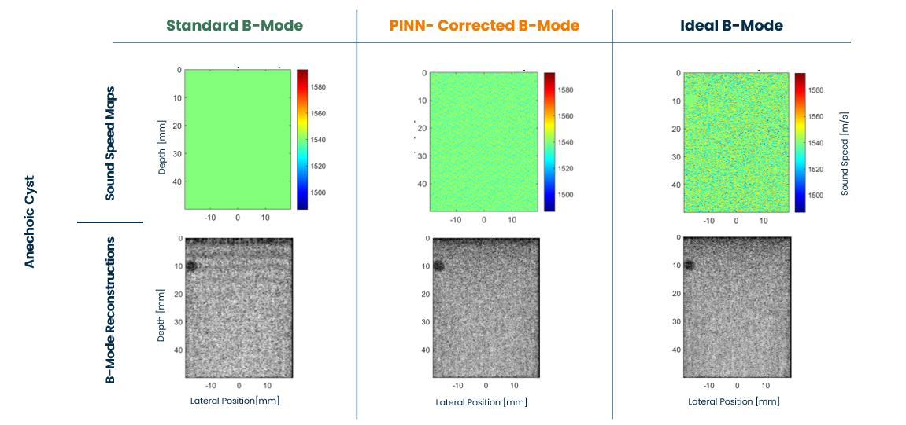
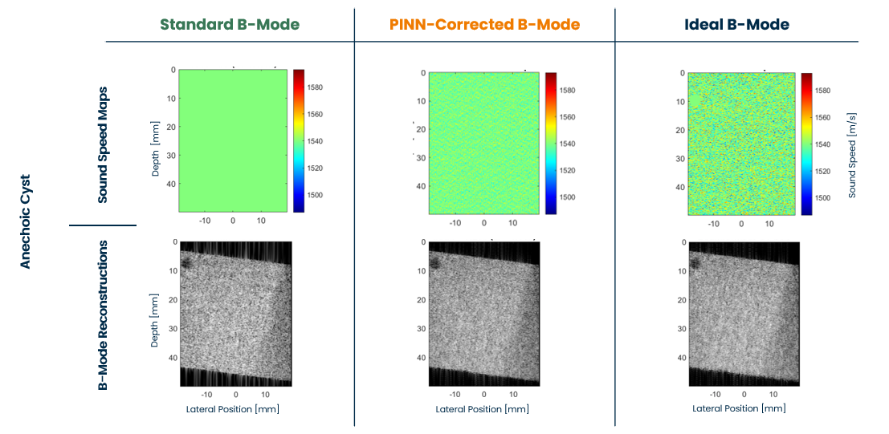

# 🚀 Physics-Informed Neural Networks (PINNs) for Sound Speed Estimation from Multi-View Ultrasound Data

[](https://www.python.org/downloads/)
[](https://pytorch.org/)
[](https://www.docker.com/)
[](https://docs.pytest.org/en/7.4.x/)
[](#)

An enterprise-grade, physics-driven Deep Learning framework for quantitative ultrasound imaging. This repository provides a dual-network PINN architecture designed to solve a highly non-linear, ill-posed inverse scattering problem directly from raw, multi-view radiofrequency (RF) data.

This project was developed as a Master's Thesis in Biomedical Engineering at Politecnico di Torino.

---

## 🏭 The Industrial Application: Offline Ground Truth Generation

While standard Deep Learning models (like U-Nets) can perform real-time ultrasound inference, they require massive datasets labeled with the *true* underlying sound speed of tissues, a parameter that is physically impossible to measure *in vivo*.

This PINN framework acts as an **Offline Ground Truth Generator**. It does not aim for real-time clinical inference. Instead, it serves as a computational engine to generate perfect, spatially varying sound speed maps (error < 1 m/s) from raw RF data. These maps can then be utilized to:
1. **Perform exact Delay-and-Sum (DAS) beamforming**, eliminating phase aberration and geometric warping to reconstruct flawless B-mode images.
2. **Generate high-quality labeled datasets** required to train fast, feed-forward neural networks for real-time clinical deployment.

---

## 🧠 The Clinical Problem: Phase Aberration

Conventional medical ultrasound reconstructs B-mode images under a strong simplifying assumption: sound travels through all human tissues at a constant speed of 1540 m/s. 

In reality, biological tissues are acoustically heterogeneous. This physical mismatch induces kinematic errors, leading to severe phase aberrations, loss of lateral resolution, and geometric distortions.


*> Clinical impact of sound speed mismatch: defocusing and geometric warping.*

To transition from qualitative to **Quantitative Ultrasound (QUS)**, we must recover the true sound speed map from boundary echoes.

---

## 🔬 Our Solution: Multi-View PINN Framework

Standard data-driven Deep Learning models lack physical interpretability and struggle to generalize across unseen clinical geometries. Classical Full Waveform Inversion (FWI) is computationally prohibitive and vulnerable to cycle skipping.


This framework bridges the gap by embedding the acoustic wave equation directly into the neural network's loss function, using a **Multi-View protocol (-15°, 0°, +15°)** to actively break the depth-velocity ambiguity inherent to reflection-mode imaging.

### Dual-Network Architecture


1. **SpeedNet**: A constrained MLP that estimates the continuous, spatially varying sound speed map ($c(x,z)$).
2. **WaveFieldNet**: Reconstructs the high-frequency spatiotemporal scattered pressure field ($p_{sct}$). It utilizes **Anisotropic Fourier Features** and a targeted **7.5 MHz Frequency Injection** to overcome the spectral bias of standard neural networks.

### Key Methodological Innovations
* **Raw RF Physics-Informed Inversion**: Operates exclusively on raw RF data, completely avoiding the phase loss associated with conventional beamforming preprocessing.
* **Guided Spatiotemporal Collocation**: Concentrates 80% of collocation points dynamically along the moving analytical wavefront to maximize the PDE gradient signal.
* **Curriculum Learning**: Implements a strict network freezing strategy (Kickstart $\rightarrow$ Injection $\rightarrow$ Refinement) to stabilize the non-convex optimization landscape.

---

## 🛡️ Enterprise Software Engineering

This repository moves beyond academic scripts, providing a robust, scalable, and test-driven infrastructure.

### 1. Mathematical Quality Assurance (PyTest)
Due to the silent-failure nature of Physics-Informed Neural Networks, the core Autograd differentiation mechanism and the acoustic wave equation residual are heavily verified via automated tests using **Float64 precision** to prevent binary quantization errors on large physical constants.

```bash
pytest tests/
```

### 2. CLI Interface & Logging
The optimization engine is fully controlled via `argparse` CLI, removing all hardcoded parameters and outputting standard, redirectable logs for production monitoring.

### 3. Contrainerized Deployment (Docker)
The physics engine and its complex scientific dependencies (`h5py`, `scipy`, `torch.autograd`) are encapsulated in a deterministic Docker container.

---

## 📊 Quantitative Results
The framework was validated on 28 synthetic domains simulated with k-Wave, including localized anechoic cysts and macroscopic two-layer interfaces.

* **Bulk Property Estimation**: The PINN acts as an optimal kinematic corrector. It accurately recovers the mean sound speed with a **Mean Absolute Error (MAE) of 0.77 m/s** on anechoic cysts and **1.82 m/s** on two-layer phantoms.
* **Phase Aberration Correction**: When the predicted maps are integrated into downstream Delay-and-Sum beamforming, the Structural Similarity Index (SSIM) gets measured. The framework achieves a **90.0% success rate** in restoring spatial coherence for challenging oblique insonations.


*> Results in Anechoic Cysts at 0°. Left: Distorted B-Mode with standard 1540 m/s assumption. Middle: Phase coherence restored using the PINN-estimated sound speed map. Right: Ideal B-Mode Images with ground truth sound speed maps.*


*> Results in Anechoic Cysts at angled degrees. Left: Distorted B-Mode with standard 1540 m/s assumption. Middle: Phase coherence restored using the PINN-estimated sound speed map. Right: Ideal B-Mode Images with ground truth sound speed maps.*

---

## 📁 Repository Structure

```text
pinn-ultrasound-speed-estimation/
├── configs/                    # YAML configurations (grid specs, epochs, lr)
├── assets/                     # Images for the README
├── data/                       
│   ├── dataset/                # Excluded from Git via .gitignore
│       ├── anechoic_cyst/      # Multi-view .mat files
│         └── README.md               # Contains Kaggle Download Links
│       └── two_layers/         
│         └── README.md               
├── src/                        
│   ├── config.py               # Global dataclass configurations
│   ├── data_loader.py          # PyTorch Dataset for HDF5/v7.3 Matlab files
│   ├── model.py                # PINN, SpeedNet, WaveFieldNet architectures
│   ├── physics.py              # Analytical Gabor source & derivatives
│   ├── loss.py                 # Inverse scattering PDE & Data fidelity Autograd
│   ├── sampler.py              # 80/20 Guided spatiotemporal collocation
│   └── utils.py                # Metric tracking & diagnostic plotting
├── tests/                      
│   └── test_pde.py             # Float64 Autograd and Wave Equation validation
├── Dockerfile                  # Containerization instructions
├── main.py                     # CLI Entry point for the training loop
├── requirements.txt            
└── README.md
```

---

## 💻 Getting Started (Docker Deployment)

### 1. Dataset Download
The raw ultrasound RF data is hosted on Kaggle due to GitHub file size limits.

Please refer to the instructions in `data/.../README.md` to download the `anechoic_cyst` and `two_layers` datasets and place them in the correct directory.

### 2. Build the Engine
Ensure Docker is installed, then build the image:
```bash
docker build -t pinn-ultrasound:v1 .
```

### 3. Run the Optimization via CLI
Run the isolated inference engine via volume mounting, overriding default parameters through the Command Line Interface:

```bash
docker run --rm \
  -v "$(pwd)/data:/app/data" \
  -v "$(pwd)/Results:/app/Results" \
  pinn-ultrasound:v1 \
  --dataset-type two_layers \
  --case-name case_0010 \
  --epochs 2500 \
  --device cpu \
  --fc 7500000
```
*>Note for Windows PowerShell users: replace `$(pwd)` with `${PWD}`).*

The framework will automatically generate a `Results/Run_XX/` folder containing training logs, model checkpoints, and diagnostic plots.

---

## 📬 Contact

**Ing. Cristian Assumma**  
*MSc Biomedical Engineer | AI Healthcare & MedTech*

* [LinkedIn](https://www.linkedin.com/in/cristian-assumma-08890b224)
* [GitHub](https://github.com/cristian-assumma)

---

> This framework demonstrates the efficacy of constraining continuous neural representations with the acoustic wave equation to resolve kinematic mismatches and restore spatial coherence in quantitative ultrasound.


