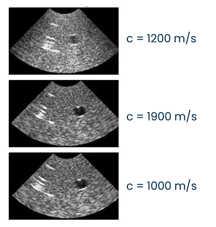
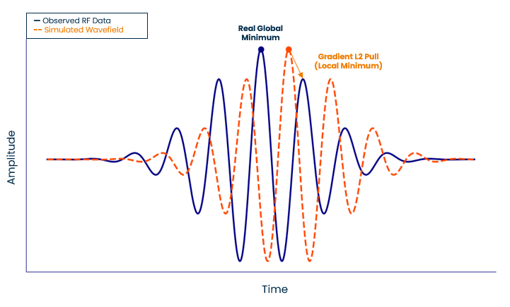
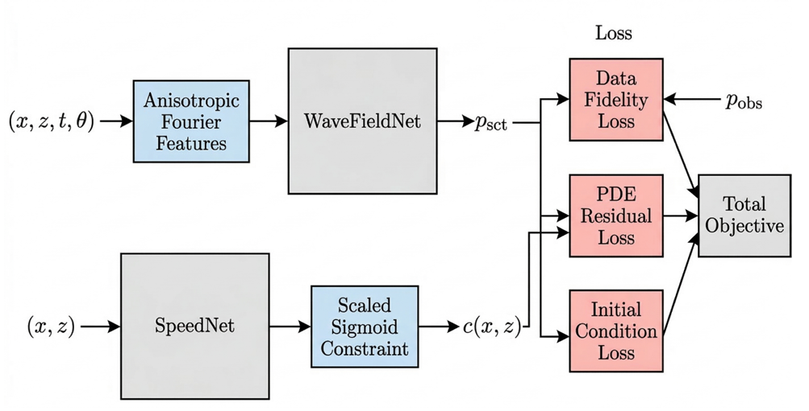

# 🚀 Physics-Informed Neural Networks (PINNs) for Sound Speed Estimation from Multi-View Ultrasound Data

[](https://www.python.org/downloads/)
[](https://pytorch.org/)
[](#)

A modular, physics-driven Deep Learning framework for quantitative ultrasound imaging. This repository provides a dual-network PINN architecture designed to estimate spatially varying sound speed maps directly from raw, multi-view radiofrequency (RF) data.

This project was developed as a Master's Thesis in Biomedical Engineering at Politecnico di Torino.

---

## 🧠 The Clinical Problem: Phase Aberration
Conventional medical ultrasound reconstructs B-mode images under a strong simplifying assumption: sound travels through all human tissues at a constant speed of 1540 m/s. 

In reality, biological tissues are acoustically heterogeneous. This physical mismatch induces kinematic errors, leading to severe phase aberrations, loss of lateral resolution, and geometric distortions. 


*> Clinical impact of sound speed mismatch: defocusing and geometric warping.*

To transition from qualitative to **Quantitative Ultrasound (QUS)**, we must solve a highly non-linear, ill-posed inverse scattering problem to recover the true sound speed map from boundary echoes.

---

## 🔬 Our Solution: Multi-View PINN Framework
Standard data-driven Deep Learning models lack physical interpretability and struggle to generalize across unseen clinical geometries. Classical Full Waveform Inversion (FWI) is computationally prohibitive and vulnerable to cycle skipping.



This framework bridges the gap by embedding the acoustic wave equation directly into the neural network's loss function, using a **Multi-View protocol (-15°, 0°, +15°)** to actively break the depth-velocity ambiguity inherent to reflection-mode imaging.

### Dual-Network Architecture



1. **SpeedNet**: A constrained MLP that estimates the continuous, spatially varying sound speed map ($c(x,z)$).
2. **WaveFieldNet**: Reconstructs the high-frequency spatiotemporal scattered pressure field ($p_{sct}$). It utilizes **Anisotropic Fourier Features** and a targeted **7.5 MHz Frequency Injection** to overcome the spectral bias of standard neural networks.

### Key Methodological Innovations
* **Raw RF Physics-Informed Inversion**: Operates exclusively on raw RF data, completely avoiding the phase loss associated with conventional beamforming preprocessing.
* **Guided Spatiotemporal Collocation**: Concentrates 80% of collocation points dynamically along the moving analytical wavefront to maximize the PDE gradient signal.
* **Curriculum Learning**: Implements a strict network freezing strategy (Kickstart $\rightarrow$ Injection $\rightarrow$ Refinement) to stabilize the non-convex optimization landscape.

---

## 📊 Quantitative Results
The framework was validated on 28 synthetic domains simulated with k-Wave, including localized anechoic cysts and macroscopic two-layer interfaces.

* **Bulk Property Estimation**: The PINN acts as an optimal kinematic corrector. It accurately recovers the mean sound speed with a **Mean Absolute Error (MAE) of 0.77 m/s** on anechoic cysts and **1.82 m/s** on two-layer phantoms.
* **Phase Aberration Correction**: When the predicted maps are integrated into downstream Delay-and-Sum beamforming, the Structural Similarity Index (SSIM) improves dramatically. The framework achieves a **90.0% success rate** in restoring spatial coherence for challenging oblique insonations.


*> Left: Distorted B-Mode with standard 1540 m/s assumption. Right: Phase coherence restored using the PINN-estimated sound speed map.*

---

## 📁 Repository Structure
The codebase is structured following professional software engineering standards for Deep Learning projects, separating configurations, physics logic, and data ingestion.

```text
pinn-ultrasound-speed-estimation/
├── configs/                    # YAML configurations (grid specs, epochs, lr)
├── data/                       
│   ├── dataset/                # Excluded from Git via .gitignore
│   │   ├── anechoic_cyst/      # Multi-view .mat files
│   │   └── two_layers/         
│   └── README.md               # Contains Kaggle Download Links
├── notebooks/                  
│   ├── 01_data_exploration.ipynb
│   ├── 02_incident_wave_fit.ipynb
│   └── 03_evaluation.ipynb     # Downstream beamforming & metrics
├── src/                        
│   ├── config.py               # Global dataclass configurations
│   ├── data_loader.py          # PyTorch Dataset for HDF5/v7.3 Matlab files
│   ├── model.py                # PINN, SpeedNet, WaveFieldNet architectures
│   ├── physics.py              # Analytical Gabor source & derivatives
│   ├── loss.py                 # Inverse scattering PDE & Data fidelity Autograd
│   ├── sampler.py              # 80/20 Guided spatiotemporal collocation
│   └── utils.py                # Metric tracking & diagnostic plotting
├── main.py                     # Entry point for the training loop
├── requirements.txt            
└── README.md
